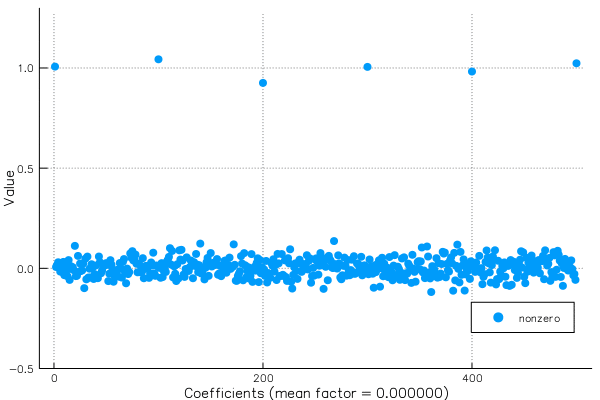
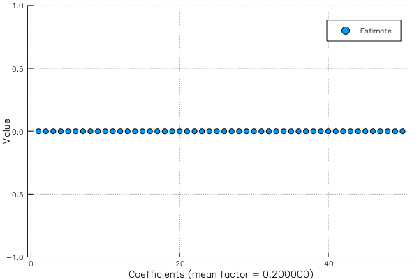
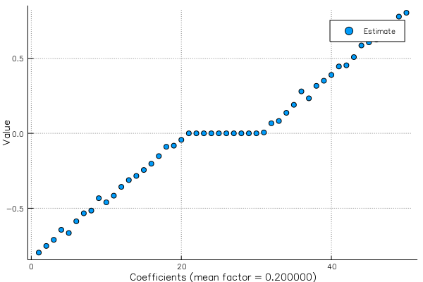
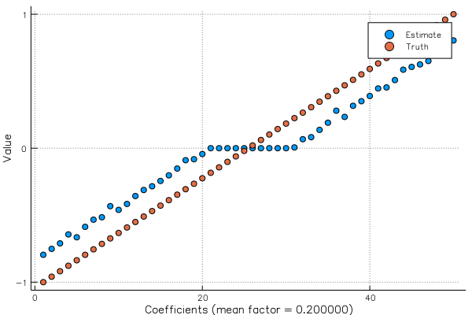
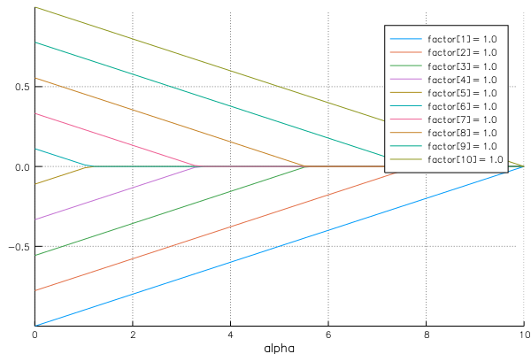

# SparseRegression.jl
### https://github.com/joshday/SparseRegression.jl
- Josh Day (`@joshday`)
- emailjoshday@gmail.com

---
# A brief History of [JuliaML](https://github.com/JuliaML)
- Created at last year's JuliaCon
- Then a lot of stuff happened:
    - LearnBase, LossFunctions, PenaltyFunctions, LearningStrategies, Transformations, MLDataUtils, Reinforce,...

---
# SparseRegression
Using the JuliaML ecosystem for high-performance algorithms:
- [LossFunctions](https://github.com/JuliaML/LossFunctions.jl)
- [PenaltyFunctions](https://github.com/JuliaML/PenaltyFunctions.jl)
- [LearningStrategies](https://github.com/JuliaML/LearningStrategies.jl)

---
# LossFunctions.jl 
Primary Author: Christof Stocker (evizero)

- Grammar of losses
```julia
loss = L2DistLoss()
value(loss, 1, 2)
deriv(loss, 1, 2)
```

---
# LossFunctions.jl
Distance-based losses ($y - \hat y$)


---
# LossFunctions.jl
Margin-based losses ($y * \hat y$)


---
# PenaltyFunctions.jl
Primary Author: me (joshday)

- Grammar of regularization functions

```julia
pen = L1Penalty()
value(pen, .1)
deriv(pen, .1)
```

---
# PenaltyFunctions.jl
 

---
# LearningStrategies.jl
Primary Author: Tom Breloff (tbreloff)

---
# LearningStrategies.jl
- Separate the components of iterative learning algorithms
	- `MaxIter(n)`
	- `TimeLimit(nsecs)`
	- `Converged(f, tol)`


---
# LearningStrategies
```julia
function learn!(model, meta::MetaLearner, data)
    pre_hook(meta, model)
    
    for (i, item) in enumerate(data)
        for mgr in meta.managers
            learn!(model, mgr, item)
        end
        iter_hook(meta, model, i)
        finished(meta, model, i) && break
    end
    
    post_hook(meta, model)
end
```

---
# The SparseRegression Model
$$
\frac{1}{n}\sum_{i=1}^n f_i(\beta) + \sum_{j=1}^p\lambda_j J(|\beta_j|)
$$

---
```
struct SparseReg{L <: Loss, P <: Penalty, O <: Obs}
    β::Vector{Float64}
    λfactor::Vector{Float64}
    loss::L
    penalty::P
    obs::O
end
```
---
# Why *Sparse* Regression

With certain penalties, as $\lambda_j$ increases, $\beta_j$ shrinks to 0


---
# SparseRegression
- Brings together primitives from LossFunctions, PenaltyFunctions, and LearningStrategies
- `SparseReg` model type
- Algorithm types, `<: LearningStrategy`

---
```julia
using SparseRegression, DataGenerator

# First, create some data
x, y, β = linregdata(10_000, 50)
```

---
```julia
o = SparseReg(Obs(x, y), LinearRegression(), 
    L1Penalty(), fill(.2, 50))
```
<br>

```
■ SparseReg
  >           β:  [0.0 0.0 … 0.0 0.0]
  >    λ factor:  [0.2 0.2 … 0.2 0.2]
  >        Loss:  0.5 * (L2DistLoss)
  >     Penalty:  L1Penalty
```

---
# Model Starts "Empty"


---
# It must be learned!

```
learn!(model, algorithm)
learn!(model, algorithm, maxiter)
learn!(model, algorithm, maxiter, strategies...)
```
<br>

```julia
learn!(o, ProxGrad(), MaxIter(50), Converged(coef))
```

```
INFO: Converged after 8 iterations: [-0.798185, ...
```
---


---



---
# Solution Paths
- Add a parameter $\alpha$
- Minimize for a variety of $\alpha$'s:
$$
\frac{1}{n}\sum_{i=1}^n f_i(\beta) + \alpha\sum_{j=1}^p\lambda_j J(|\beta_j|)
$$
---
```julia
x, y, b = linregdata(1_000_000, 10)

o = SparseReg(Obs(x, y), L1Penalty())

path = SparseRegPath(o, linspace(0, 10, 50))

learn!(path, ProxGrad(), MaxIter(20), Converged(coef))
```
```
■ SparseRegPath
  >    λ factor:  [1.0, 1.0, 1.0, 1.0, 1.0, 1.0, 1.0, 1.0, 1.0, 1.0]
  >        Loss:  0.5 * (L2DistLoss)
  >     Penalty:  L1Penalty
  > β(0.00) : [-0.999718, -0.776768, -0.555602, ...
  > β(0.20) : [-0.979222, -0.756312, -0.535105, ...
  > β(0.41) : [-0.958725, -0.735857, -0.514608, ...
      ⋮
  > β(9.59) : [-0.0383995, -0.0, -0.0, ...
  > β(9.80) : [-0.0180122, -0.0, -0.0, ...
  > β(10.00) : [-0.0, -0.0, -0.0, ...
```

---
# Plotting
```julia
plot(path)
```


---
# Note:
We haven't sacrificed performance for generality
```julia
@btime GLM.lm(x,y);
  2.790 ms (21 allocations: 9.16 MiB)

@btime MultivariateStats.llsq(x, y, bias=false)
  2.395 ms (10 allocations: 1.42 KiB)

@btime learn!(SparseReg(Obs(x,y), NoPenalty()), Sweep())
  2.434 ms (26 allocations: 3.41 KiB)
```

---
# TODOs
- Make work with more AbstractArrays (sparse, other)
- A few opportunities for optimizations
- More algorithms (Coordinate Descent)
- Cross-validation schemes

---
# Final Words
- This is not glmnet
- Easily extendable for new losses, penalties, and algorithms

---
# Thank You