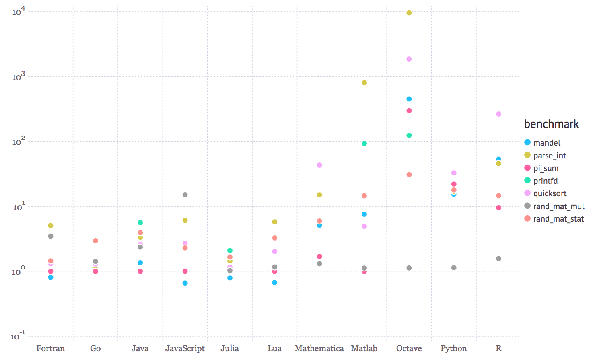
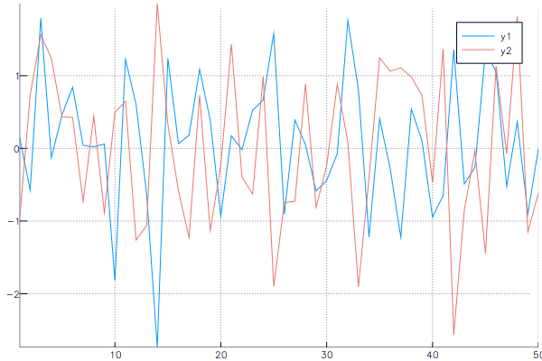

# Julia for Technical Computing
## Josh Day
##### https://github.com/joshday
##### emailjoshday@gmail.com

---
# To run the examples
```julia
pkgs = [
    "Distributions", 
    "Plots", 
    "PyPlot", 
    "GR", 
    "RCall",
    "BenchmarkTools",
    "Query",
    "DataTables"
]

for pkg in pkgs
    Pkg.add(pkg)
end
```

---
# Overview
- What is Julia?
- Design, Type System, and Multiple Dispatch
- Julia Packages
- Macros (if time)

---
# What is Julia?

---
# What is Julia?
> Julia is a high-level, high-performance dynamic programming language for technical computing, with syntax that is familiar to users of other technical computing environments.
- http://julialang.org

---
# What is Julia?
- Solves the "Two-Language Problem"
- High-level code which produces fast, low-level machine code that has traditionally only been generated by static languages. 

---
# Benchmarks


---
# More than "Fast R" or "Fast Python"
- Julia is fast because of features which work well together
- You can't just take the magic dust that makes Julia fast and apply it to your favorite language

---
# Julia Language Design
- Type system
- Multiple dispatch
- Type inference
- Metaprogramming (macros)
- Just-in-time (JIT) compilation using LLVM
- Clean, familiar syntax

---
# Julia's Growth (Number of Packages)


---
# Julia's Growth (Stars on GitHub)


---
# Design, Type System, and Multiple Dispatch
---
# Julia Basics
## Everything has a type
```julia
1    # typeof(1) == Int64

1.0  # Float64

# Arrays have 1-based indexing
[1.0, 2.0]  # Vector{Float64}
```

---
# Julia Basics
## Supports Unicode Characters
- Julia's main focus is numerical computing, so creators want code to look similar to mathematical formulas:
  $$\hat\beta = (X^TX)^{-1}X^Ty$$
```julia
β̂ = inv(x'x)x'y  # Implicit multiplication

β̂ = inv(x' * x) * x' * y  
```
- Compare this to R:
```r
betahat = solve(t(x) %*% x) %*% t(x) %*% y
```


---
# Julia Basics
## Functions
```julia
f(x) = x ^ 2

# Code blocks require an `end`
function f(x)
    x ^ 2
end
```

---
# Julia Basics
## JIT
- live example with `@code_llvm` macro

```julia
f(x) = x ^ 2
```

---
# Julia Basics
## For loops
Input:
```julia
for i in 1:3
    println(i)
end
```
Output:
```
1
2
3
```

---
# Type System
- When thinking about types, think about sets
- An **abstract** type defines a set of other types
- One abstract type in Julia is `Number`

---
# `Number`


---
# `Number`
- What should a `Number` be able to do?
  `+`, `-`, `*`, etc. 
```julia
methods(*)
```
```julia
# 178 methods for generic function "*":
*(x::Bool, z::Complex{Bool}) in Base at complex.jl:225
*(x::Bool, y::Bool) in Base at bool.jl:91
*(x::Bool, y::T) where T<:Unsigned in Base at bool.jl:104
*(x::Bool, z::Complex) in Base at complex.jl:232
*(x::Bool, y::Irrational) in Base at irrationals.jl:105
*(x::Bool, y::T) where T<:Number in Base at bool.jl:101
*(a::Float16, b::Float16) in Base at float.jl:368
*(x::Float32, y::Float32) in Base at float.jl:374
*(x::Float64, y::Float64) in Base at float.jl:375
...
```

---
# Multiple Dispatch
- The idea of calling different code depending on the types of the arguments is called **multiple dispatch**.

- Consider the Distributions package, where every distribution has its own type.
```julia
using Distributions

mean(Normal(0,1)) == 0.0

mean(Gamma(10,6)) == 60.0
```

---
# Abstraction
- Consider these three function definitions:
```julia
# Too broad:  Not everything can be added
f(x) = x + x


# Too specific:  Numbers besides Float64 can be added
g(x::Float64) = x + x


# Just right:  Every number has a `+` method, so this 
# works on the entire type tree in the previous slide
h(x::Number) = x + x
```


---
# Quantile Example
- Suppose I want to find quantiles using Newton's method:
$$\theta_{t+1} = \theta_t - \frac{F(\theta_t) - q}{F'(\theta_t)}$$
  where $F$ is the CDF of a distribution
- In R, I would need a different function for every distribution!
- In Julia, we can do this in one function

---
# The Power of Julia: Abstraction
- Define functions for the "highest" type you can
- A `UnivariateDistribution` has methods `mean`, `cdf`, `pdf`
```julia
using Distributions

function myquantile(d::UnivariateDistribution, q::Number)
    θ = mean(d)
    tol = Inf
    while tol > 1e-5
        θold = θ
        θ = θ - (cdf(d, θ) - q) / pdf(d, θ)
        tol = abs(θold - θ)
    end
    θ
end
```

---
Input:
```julia
for d in [Normal(), Gamma(5,1), TDist(4)]
    println("For $d")
    println("  > myquantile: $(myquantile(d, .4))")
    println("  > quantile:   $(quantile(d, .4))\n")
end
```
Output:
```julia
For Distributions.Normal{Float64}(μ=0.0, σ=1.0)
  > myquantile: -0.2533471031356957
  > quantile:   -0.2533471031357997

For Distributions.Gamma{Float64}(α=5.0, θ=1.0)
  > myquantile: 4.1477358804705435
  > quantile:   4.1477358804705435

For Distributions.TDist{Float64}(ν=4.0)
  > myquantile: -0.27072229470638115
  > quantile:   -0.27072229470759746
```

---
# Defining types
- Your own types are just as performant as Julia's built-ins.
- Most of Julia is written in Julia
```julia
# Can change `a` after creating a new instance
type MyType
    a::Int64
end

# Can NOT change `a` after creation
immutable MyOtherType{T <: Number}
   a::T
end
```

---
# Defining methods
Input:
```julia
f(m::MyType) = o.a + o.a

o = MyType(4)
f(o)
```
Output:
```
8
```

---
# Julia's Package Ecosystem

---
# Plotting and Graphics
#### Julia does not have a built-in plotting package

- [Plots](https://github.com/JuliaPlots/Plots.jl)
  - Defines a plotting API that can use several "backends"
- [Gadfly](https://github.com/GiovineItalia/Gadfly.jl)
  - Grammar of graphics for Julia
- Others: PyPlot, UnicodePlots, GR, GLPlot, Winston, ...

---
# Plots with PyPlot

```julia
using Plots
pyplot()  # use PyPlot backend
plot(randn(50, 2))
```


---
# Plots with GR
```julia
gr()  # use GR backend
plot(randn(50, 2))
```


---
# Easy Animations
```julia
anim = @animate for i in 1:20
    plot(sin, 0, i, xlim = (0,20), ylim = (-1, 1))
end
gif(anim, "/Users/joshday/Desktop/my_animation.gif")
```
```
INFO: Saved animation to /Users/joshday/Desktop/my_animation.gif
```


---
# Calling R from Julia
- Side note: REPL modes 
  - `;` (shell mode)
  - `?` (help mode)
- RCall adds
  - `$` (R mode) 
 
```julia
using RCall
R"rnorm(5)"
```

---
# Calling Python from Julia
Input:
```julia
using PyCall
@pyimport math

math.pi
```
Output:
```
3.141592653589793
```

---
# Statistics, Working with Data, Machine Learning, etc.

- StatsBase, GLM, DataFrames, Query, MixedModels, Distributions, KernelDensity, OnlineStats, LossFunctions, 

---
# StatsBase

Much of the functionality built into R

```julia
using StatsBase

sample(1:5, 5, replace = false)
```

---
# DataFrames and DataTables
- Both for working with tabular data
- DataTables is a fork of DataFrames
  - Behind the scenes containers are different 
    - `DataArray` vs. `NullableArray`

---
# DataTables
Input:
```julia
iris = readtable(joinpath(Pkg.dir("DataTables"), "test/data/iris.csv"))
head(iris)
```
Ouput:
```
6×5 DataTables.DataTable
│ Row │ SepalLength │ SepalWidth │ PetalLength │ PetalWidth │ Species │
├─────┼─────────────┼────────────┼─────────────┼────────────┼─────────┤
│ 1   │ 5.1         │ 3.5        │ 1.4         │ 0.2        │ setosa  │
│ 2   │ 4.9         │ 3.0        │ 1.4         │ 0.2        │ setosa  │
│ 3   │ 4.7         │ 3.2        │ 1.3         │ 0.2        │ setosa  │
│ 4   │ 4.6         │ 3.1        │ 1.5         │ 0.2        │ setosa  │
│ 5   │ 5.0         │ 3.6        │ 1.4         │ 0.2        │ setosa  │
│ 6   │ 5.4         │ 3.9        │ 1.7         │ 0.4        │ setosa  │
```

---
# Query (query almost any data source)
```julia
using Query

x = @from i in iris begin
    @where i.Species == "setosa" && i.PetalLength > 1.7
    @select i
    @collect DataTable
end
```

```
2×5 DataTables.DataTable
│ Row │ SepalLength │ SepalWidth │ PetalLength │ PetalWidth │ Species │
├─────┼─────────────┼────────────┼─────────────┼────────────┼─────────┤
│ 1   │ 4.8         │ 3.4        │ 1.9         │ 0.2        │ setosa  │
│ 2   │ 5.1         │ 3.8        │ 1.9         │ 0.4        │ setosa  │
```


---
# Macros

---
# Macros
- Macros are functions of expressions
- They change an expression before it is run, and can therefore do many things!
```julia
x = randn(1000);

@time sum(x)  # JIT at work
#   0.031018 seconds (12.86 k allocations: 602.013 KB)
# -34.195601715147035

@time sum(x)
#   0.000003 seconds (5 allocations: 176 bytes)
# -34.195601715147035
```

---
# Macros (turn off bounds checking)
```julia
x = rand(1000)

for i in eachindex(x)
    @inbounds x[i] *= 5.0
end
```

--- 
# Macros (benchmarking)
```julia
using BenchmarkTools
@benchmark sum(x)
```
```
BenchmarkTools.Trial:
  memory estimate:  16 bytes
  allocs estimate:  1
  --------------
  minimum time:     223.916 ns (0.00% GC)
  median time:      231.385 ns (0.00% GC)
  mean time:        237.263 ns (0.86% GC)
  maximum time:     7.247 μs (95.52% GC)
  --------------
  samples:          10000
  evals/sample:     455
  time tolerance:   5.00%
  memory tolerance: 1.00%
```

---
# Macros (Other)
```julia
@which sum(x)  # find the method being called

@edit sum(x)   # open file where the method is
```

---
# Summary
- **Julia is ideal for developing projects from scratch/with few dependencies**
- The package ecosystem grows fast but is still lacking much of the functionality you can find in R.
- There are also many interesting things in Julia that R doesn't have:
  - Plots, Convex, JuMP, OnlineStats, Distributions, LossFunctions, ...


---
# Thank You